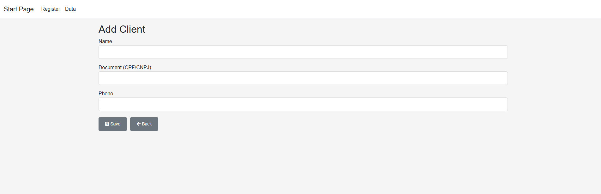
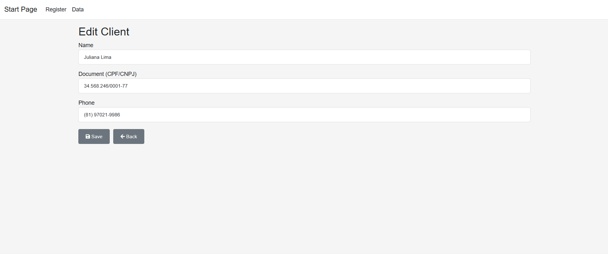
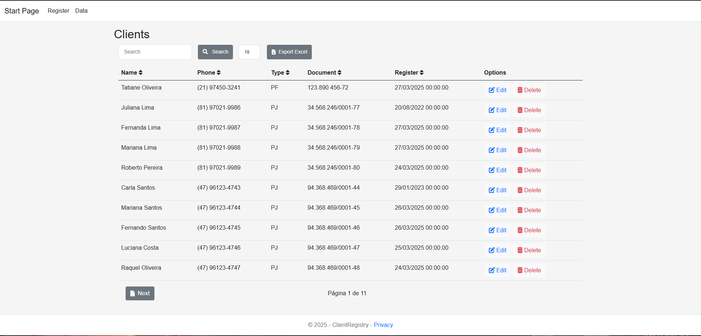
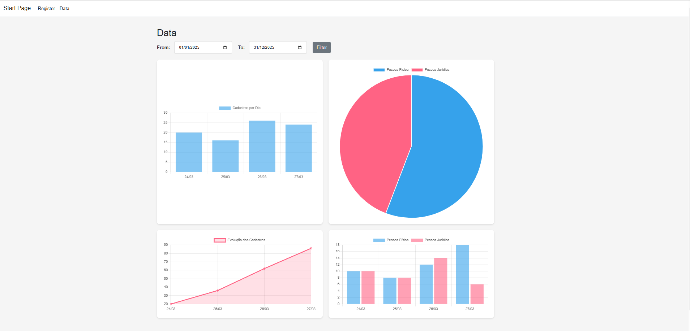

# ClientRegistry - Sistema de Cadastro de Clientes

## Visão Geral

Este é o sistema **ClientRegistry** que permite o cadastro, visualização, edição, remoção de clientes, além de gerar gráficos de análise sobre os cadastros realizados. 

### Tecnologias Utilizadas

- **Frontend**: HTML, CSS, jQuery
- **Backend**: .NET 8 com arquitetura MVC
- **Banco de Dados**: MySQL com **Entity Framework (Code First)**
- **Gráficos**: **Chart.js** para gerar gráficos interativos
- **Exportação de Dados**: **EPPlus** para exportação para Excel

## Configuração do Ambiente

### 1. Configurar a String de Conexão no `appsettings.json`

No arquivo `appsettings.json`, localize a seção `"ConnectionStrings"` e configure a string de conexão para o MySQL:

```json
{
  "ConnectionStrings": {
    "connection": "server=localhost;initial catalog=ClientRegistryDataBase;uid=*admin*;pwd=*admin*;"
  }
}
```

### 2. Executar a ORM para a geração do Banco pelo `Gerenciador de Pacotes`

No Gerenciador de Pacotes do VStudio, selecione o ProjetoPadrão: Infra, e digite: `Update-Database`

[Baixar arquivo com Inserts para a tabela Cliente (MYSQL)](https://raw.githubusercontent.com/EduardoGuedes06/ClientRegistry.MVC/main/doc/Insert.sql)

## Funcionalidades

### Cadastro de Clientes



O sistema permite o cadastro de clientes com as seguintes informações:
- **Nome**: Nome completo do cliente.
- **Tipo**: Tipo de pessoa (PF ou PJ).
- **Documento**: CPF (para PF) ou CNPJ (para PJ), com máscara e validação.
- **Telefone**: Número de telefone do cliente.
- **Data de Cadastro**: Gerado automaticamente ao cadastrar.

### Validações
- **Nome**: Campo obrigatório.
- **Tipo**: Campo obrigatório, com opções **PF** ou **PJ**.
- **Documento**: Validação dinâmica baseada no tipo de cliente. CPF para **PF** e CNPJ para **PJ**.
- **Telefone**: Campo obrigatório.

### Edição e Remoção de Clientes



- **Edição**: Possibilidade de editar todos os campos, exceto a data de cadastro.
- **Remoção**: Realização de **soft delete** (registro marcado como removido, sem exclusão física no banco).

### Listagem de Clientes


- **Filtros**: É possível filtrar os clientes por **Nome** ou **Documento**.

### Gráficos Gerados

   

- **Cadastros por Dia**: Gráfico de barras mostrando os cadastros por dia.
- **Proporção de PF vs PJ**: Gráfico de pizza exibindo a proporção de clientes PF e PJ.
- **Evolução Acumulada de Cadastros**: Gráfico de linha exibindo a evolução dos cadastros ao longo do tempo.
- **PF vs PJ por Dia**: Gráfico de barras mostrando a comparação entre PF e PJ por dia.

### Exportação para Excel

- Utilização da biblioteca **EPPlus** para exportar a lista de clientes para um arquivo Excel.

## Estrutura do Projeto

### 1. **Backend (ASP.NET Core MVC)**

O projeto segue a arquitetura **MVC** e utiliza o **Entity Framework (Code First)** para o mapeamento de dados para o banco de dados MySQL. A lógica de negócios e validação é implementada no **Controller**, com os dados sendo manipulados através do **Model** e **View**.

